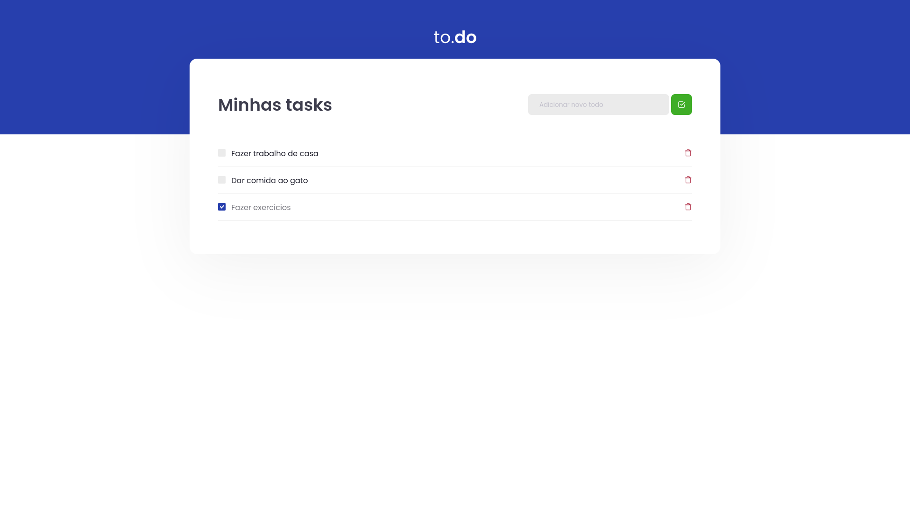

# ReactJs Todo app

## Bem vindo! 👋

Obrigado por acessar este projecto.

## O desafio

O desafio foi construir esta páginae e fazer as funcionalidades com o ReactJs.

Os usuários devem ser capazes de:

- Adicionar novas tarefas
- Marcar as tarefas como finalizadas
  -Eliminar as tarefas da lista

### 🛠 Tecnológias

Estas são as ferramentas que foram utilizadas na construção do projeto:

**Have fun building!** 🚀
